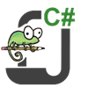
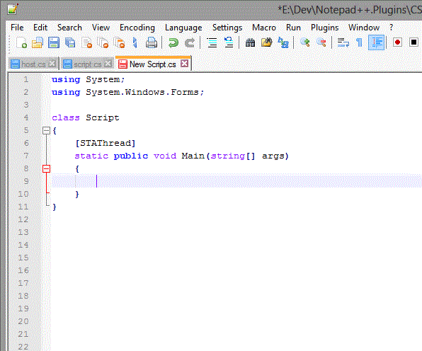
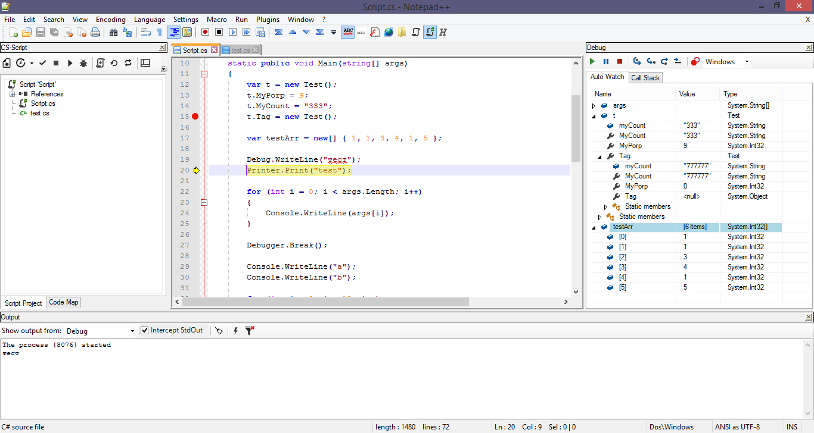
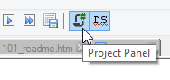
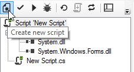
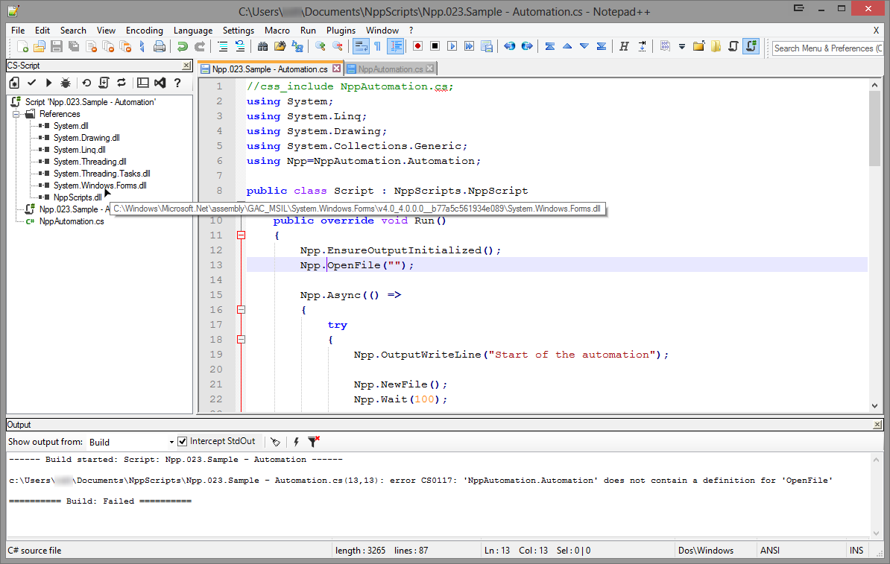

# CS-Script Plugin (CSScript.Npp)   

[Download latest release](https://github.com/oleg-shilo/cs-script.npp/releases)

*This Notepad++ plugin requires .NET v4.0 or higher.* 

----

### .NET Framework -> .NET  transition 

_The current release of CS-Script targets .NET Core family runtime (.NET 6).  
CS-Script started targeting .NET 5+ about a year ago as .NET Framework further development has been effectively cancelled by the .NET team._ 

_Since the plugin is shipped with the engine targeting by default .NET Core, some users who are still relying on .NET Framework will need to use older versions of the plugin. Unfortunatelly Notepad++ has introduced recently some breaking changes so you will need to downgrade both Notepadd++ and the plugin (see this [Issue](https://github.com/oleg-shilo/cs-script.npp/issues/71#event-7594997459) to find out the compatible combination)._

----

Total downloads via Notepad++ Plugin Manager: Total Downloads Count:             
[Downloads Statistics](http://www.csscript.net/statistics/css.npp.stats.html)

\* _statistics does not include x64 downloads nor downloads after Notepad++ discontinued shiping editor with the x86 plugin manager included_ 

Starting from v1.3 plugin delivers full support for VB.NET syntax. [More reading...](https://github.com/oleg-shilo/cs-script.npp/wiki/VB.NET-Support)  

You can also run scripts targeting [.NET 5/Core runtime](https://github.com/oleg-shilo/cs-script.npp/wiki/.NET-Core).
____
This plugin allows convenient editing and execution of the C# code (scripts).  It also allows the usual C# intellisense and project management tasks to be performed in a way very similar to the MS Visual Studio.

Older versions of plugin that targer .NET Framework provide generic debugging functionality (with the integrated Managed Debugger) as well as the ability to prepare C# scripts for the deployment packages (script+engine or self-contained executable). Debugging is not supported on the .NET Core editions.

Typically user opens the C# file with Notepad++ and after presses 'Load' button on the CS-Script toolbar the all features can be accessed through two Notepad++ dockable panels Project and Output panel. 

_Debugger is only available for older versions of plugin that targer .NET Framework but not .NET Core. For .NET Core use Visual studio to debug your scripts._

## Features

Note: the default compiler engine of the plugin is Roslyn. The engine fully supports both C# and VB.NET syntax but there is some usability information for these syntaxes that you may need to be aware of. See [C# 7 support](https://github.com/oleg-shilo/cs-script.npp/wiki/C%23-7-support) for and [VB.NET support](https://github.com/oleg-shilo/cs-script.npp/wiki/VB.NET-Support) details.

* Intellisense
  * CLR type members auto-complete (Ctrl+Space or type '.')
  * Add missing 'using' (Ctrl+.)
  * Show CLR type quick info. (Hover mouse over the type member)
  * Show Method Overloads popup. (F6 or type '(')
  * Go to definition (F12)
    - in the source code
    - in the reconstructed referenced assembly API interface (including XML documentation)
  * Smart Indentation
  * Formatting C# source code
  * CodeMap - panel with the class members of the current .cs document  
 
* Based on 'plain vanilla' ECMA-compliant C# code
* Inclusion of the dependency scripts via CS-Script directives
* Implicit assembly referencing via automatic resolving namespaces into assemblies
* Explicit assembly referencing via CS-Script directives
* Debug output interception
* Console output interception
* Conventional build/execution error reporting
* Debugging (.NET Framework only)
  - Step Over
  - Step In
  - Step Out
  - Set Next Statement
  - Toggle breakpoint
  - 'Call Stack' 
  - 'Locals' 
Preparing the script deployment package so it can be executed outside of Notepad++.  
The plugin is a part of CS-Script tools for Notepad++ suite. All details on the system requirements, installation and usage can be found on CS-Script.Npp home page.

## Usage

After the installation start Notepad++ and click "Project Panel" button on the toolbar (or "Project Panel" menu item in the Plugins->CS-Script menu). 

Then Click 'New Script' button. The script is ready. Just press F5 and see the script being executed.

