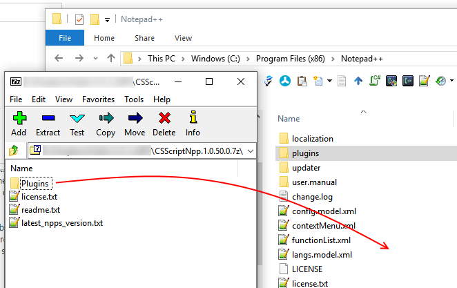

# Manual Installation

_Sometimes it is preferred/required to perform a manual plugin installation. This is a simple and yet potentially troublesome process. This article is will guide you through this process._

_**Background**_
In some cases after plugin installation Notepad++ (N++) may report  "This plugin is not compatible 
with current version of Notepad++." failure at startup and manual installation may be performed to address the issue.

The failure message text is on the N++ team conscience :)
N++ never ever tests any plugin compatibility at all. What it does is attempting to load the plugin and if *any* problem arises it is reported as a compatibility problem. Thus the true nature of the problem is actually never known.

So far in almost 100% cases the problem was caused by the Windows silently blocking plugin assemblies after the manual installation of the plugin from the distribution package downloaded from the internet. And only in a tiny proportion of the cases the problem was attributed to the incomplete plugin installation due to the interrupted (for whatever reason) update process. 

The assembly blocking is a 'fantastic' Windows security invention introduced in Vista. Thus OS silently locks any assembly extracted from the archive (e.g. zip) originated from the internet. This OS feature itself is not necessarily bad but the its user experience is quite is quite shocking. It newer tells that the downloaded content has been disabled system wide and when the the user tries to execute the content it never tells why the execution fails.

That is why updating plugins via N++ Plugin Manager or CS-Script.Update (from About box) is a preferred way of deploying CS-Script.Npp plugin. However if manual install is required (e.g. troubleshooting) then certain precaution should be taken and the following simple steps most likely will help you to complete the installation successfully.

_**Manual Installation Steps**_

* Close all instances of Notepad++
* Remove CSSriptNpp.dll and CSScriptNpp folder form %ProgramFiles%\Notepad++\plugins directory.
* Download plugin *.7z package form the plugin Downloads page.
* Extract the 'plugins' folder from the content of the package (e.g. CSScriptNpp.1.0.50.0.7z) into N++ plugins dir as follows.
 * Open .7z in the 7Zip client application. Note: never use neither WinZip nor WinRar for this as these two product lead to the assembly locking problem.
 * Merge package 'plugis' folder with the %ProgramFiles%\Notepad++\plugins by drag and drop:

