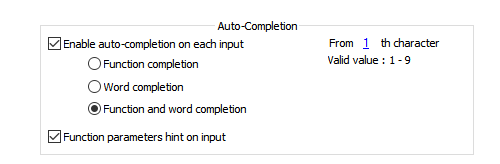
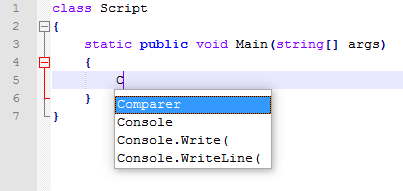
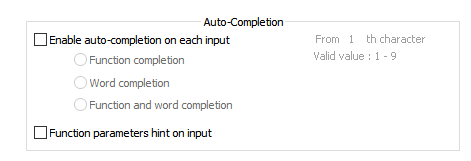

# Dealing with Notepad++ native auto-complete
_CS-Script for Notepad++_ offers a complete true Intellisense for solution fr C#/VB code. Thus any additional codding assistance from the editor isn't really required. Particularly because any context nonspecific solution (e.g. Notepad++ auto-completion) can hardly compete with rich context based codding assistance tools typically found in the top shelf IDEs (e.g. Visual Studio Intellisense) . 

> _Notepad++ auto-completion is a feature logically consistent with Intellisense user experience. It is a popup suggestion list where the user can select the suggestion to auto-complete partially typed word instead of completing it manually (by typing). However as opposite to Intellisesne auto-completion suggestion list mainly consist of pre-configured (hard-codded) frequently used words and does not reflect the nature of the object, whose member is being completed._

Notepad++ auto-completion popup can be triggered in two ways: 
* _Automatically_: by user making some specific typing input
* _Manually_: by user pressing dedicated shortcut (```Ctrl+Space```)
Both Notepad++ auto-completion and CS-Script Intellisense do not directly conflict with each other but having them active together for *.cs files compromises user experience as they will "compete" for your attention. 

That is why CS-Script plugin intercepts ```Ctrl-Space``` keystrokes for {"*.cs"} files so Notepad++ auto-completion doesn't popup and user interaction with Intellisense remains uninterrupted. 

While manual triggering of Notepad++ auto-completion is suppressed for {"*.cs"} files an unintended automatic triggering is still possible. Because it doesn't rely on ```Ctrl-Space``` keystroke event. 

Do a simple experiment:
* Ensure you have the following configuration for this experiment:


* Open any *.cs file and type type character 'C'. The suggestion list will immediately popup:



This behavior cannot be prevented for specific document types (e.g. {"*.cs"}) as Notepad++ controls it via the editor *global* settings. Meaning that if you want to have uninterrupted C# Intellisense experience you may want to disable automatic triggering of the Notepad++ auto-complete from the configuration:



*_Note: this will not disable auto-completion for other languages but only disable its automatic triggering. The auto-completion can be triggered at any time manually by pressing ```Ctrl+Space``` key combination._*

  