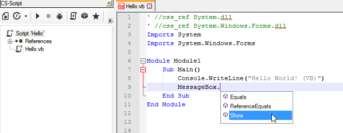
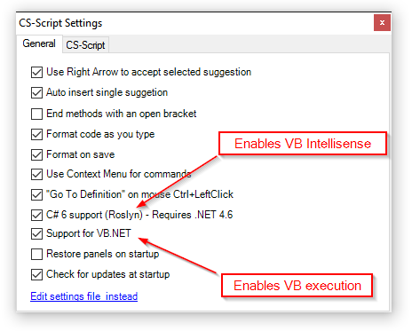

# VB.NET Support

CSScript.Npp is a solution that targets C# as a primary syntax. However the actual execution engine that powers the script execution for years was able to execute scripts written in other languages. Such  execution does require a special adapter (CodeProvider), which delegates the actual IL generation to the compiler capable of handling language specific syntax. 

Writing such an adapter is very simple and can be done for any language targeting CLR. CS-Script comes with the adapter  CSSCodeProvide.dll for executing VB.NET code: [http://www.csscript.net/help/vb.html](http://www.csscript.net/help/vb.html) 
Meaning that running/debugging VB.NET scripts from Notepad++ is possible.

Recent development in the plugin Intellisense related sub-components brought Roslyn compiler-as-service solution into the game. The plugin uses Roslyn for execution and Intellisense support for C# 6 syntax. Fortunately enough Roslyn is capable of understanding VB.NET syntax as well and it can handle Intellisense tasks for VB as good as for C#.

All this made it possible to implement full VB.NET support in CSScript.Npp starting from v1.3.  This covers both script execution/debugging and Intellisense. 


In order to enable support for the scripts written in VB.NET you need to enable both "VB support..." and "Roslyn..." options in the plugin settings.


The user experience is not very different to the one available for C# though there are some points you need to be aware of: 

* Intellisense can support .NET v4.6 specific VB features (if any) and the execution is limited to the level of .NET v4.0. This is because the plugin is currently shipped with the version of Roslyn (.NET v4.6) that can only handle Intellisense bit not the VB compilation when it's hosted from unmanaged application. Though it may change in future.

* CodeMap panel currently supports only C# and Python syntax.

* Automatic assembly referencing via resolving ```using <namespace>;``` is not possible because for VB is using different syntax for this. Thus you will nee to rely on explicit ```//css_*``` directives for this and configured default namespaces/assemblies. All ```//css_*``` must be prefaced with VB _comment character_ + _space character_ so VB compiler doesn't interpret the directive as a VB statement.
```vb
' //css_ref System
' //css_ref System.Windows.Forms
Imports System
Imports System.Windows.Forms
...
```

